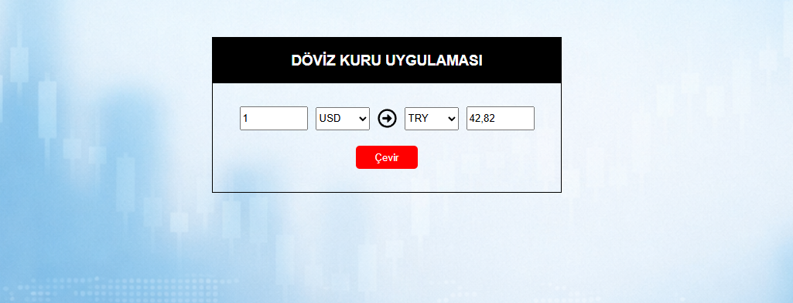

💱 Döviz Kuru Uygulaması

Basit ve anlaşılır bir döviz kuru çevirme uygulaması.
React kullanılarak geliştirilmiş, gerçek zamanlı döviz verileri bir API üzerinden alınmaktadır.

🚀 Özellikler

- Döviz kuru çevirme

- Para birimi seçimi (USD, EUR, TL vb.)

- Gerçek zamanlı API verisi

- Temiz ve sade arayüz

- Vanilla CSS ile stil verme (UI library kullanılmadı)

🛠️ Kullanılan Teknolojiler

- React

- JavaScript (ES6+)

- Axios

- CSS (Vanilla)

## 📸 Screenshot

🎯 Amaç

Bu proje, React öğrenme sürecimde:

- API kullanımı

- State yönetimi

- Temel layout ve CSS becerilerini
pekiştirmek amacıyla geliştirilmiştir.

🌱 Geliştirme Fikirleri

- Responsive tasarımın iyileştirilmesi

- Dark / Light mode

- Daha fazla para birimi

- UI library (Tailwind, MUI vb.) ile arayüz geliştirme

👤 Geliştirici

Gowzher